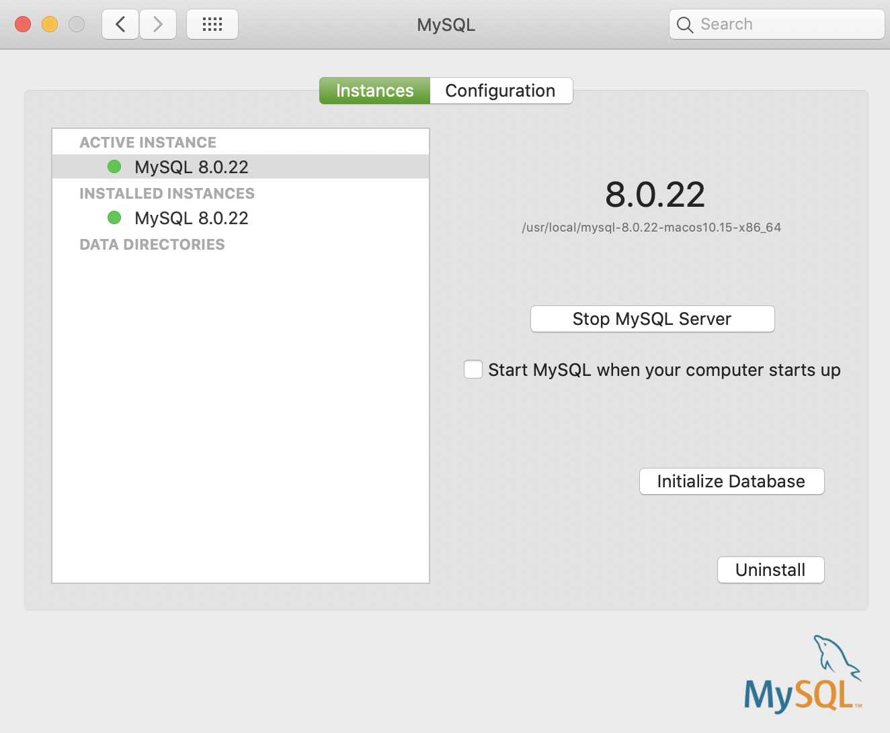
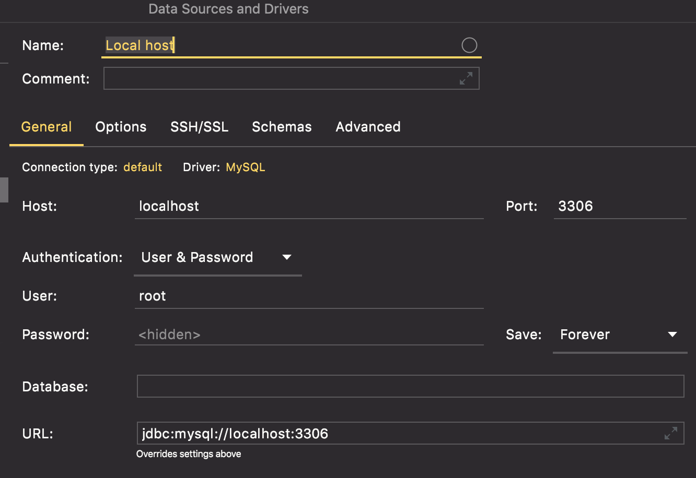
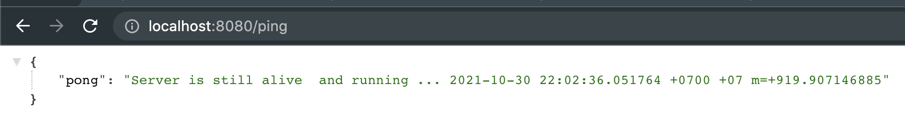
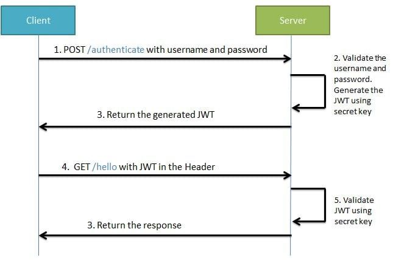

# Nogopy

# Hi, this a demo of how to use jwt for authentication in microservices
# Keep in mind that this is a demo of how to authenticate using jwt, we don't cover any issues such as sql injection, you can easily produce it to hack the server.

## Project layout

    .
    ├── cmd                    # Main applications.
    ├── config                 # Configuration file templates or default configs.
        ├── database           # Config for database.
        ├── environment        # Config for environment variables.
        ├── infrastructure     # Config for http server and worker jobs.
    ├── docs                   # Swagger API.
    ├── internal               # Private application and library code.
        ├── app
            ├── jwt-for-authentication
                ├── controllers        # REST controllers.
                ├── dto                # Data transfer object.
                ├── middlware          # Middleware of REST server.
                ├── models             # Model of RDBMS or NoSQL.
                ├── repositories       # Repositories layer.
                ├── routers            # Routing.
                ├── services           # Business services.
                ├── utils              # Utility.
    ├── script                         # Scripts to perform various build or test
    └── README.md
    
## Dependency

Nogopy uses a number of open source projects to work properly:

- [Gorm] - The fantastic ORM library for Golang
- [Gin] - Gin is a web framework written in Go
- [Logrus] - Logrus is a structured logger for Go

## Installation

Golang-template requires [Golang](https://golang.org/) v1.16 to run.

Install the dependencies and devDependencies and start the server.

```sh
export PATH=$PATH:$HOME/go/bin
go mod init github.com/nogopy/jwt-for-authentication
go mod tidy
go get github.com/codegangsta/gin
```

## Run

### Run a local mysql server if you don't have a remote one. Here I'm on Mac



### Run script to create a simple login database and user table

```shell
cd /usr/local/mysql/bin
./mysql -u root -p then enter password
create database login
```

```shell
CREATE TABLE `user` (
  `id` int(11) unsigned NOT NULL AUTO_INCREMENT,
  `username` varchar(200) NOT NULL,
  `password` varchar(200) NOT NULL,
  `created_at` datetime DEFAULT NULL,
    PRIMARY KEY (`id`),
    KEY `idx_username` (`username`)
) ENGINE=InnoDB AUTO_INCREMENT=1 DEFAULT CHARSET=utf8;
```

### Then use a tool to check if everything is ok, I recommend use Datagrip



### Clone .env.example to .env then input your config

### Finally, run the script file and enjoy

```sh
./script/run.sh
```

Verify the deployment by navigating to your server address in
your preferred browser.

```sh
127.0.0.1:8080
```


# ------------------------------------------------------------
# What is jwt and how it works https://jwt.io/introduction
# Jwt flow

Source: https://www.freecodecamp.org/news/how-to-setup-jwt-authorization-and-authentication-in-spring/

[//]: # (These are reference links used in the body of this note and get stripped out when the markdown processor does its job. There is no need to format nicely because it shouldn't be seen)

   [Gin]: <https://github.com/gin-gonic/gin>
   [Gorm]: <https://gorm.io/>
   [Logrus]: <https://github.com/sirupsen/logrus>
   [Rsa key]: <https://gist.github.com/ygotthilf/baa58da5c3dd1f69fae9>

